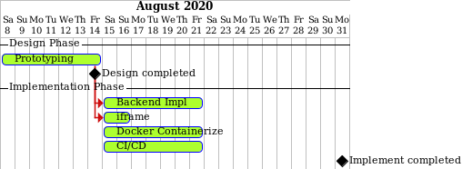

# Chat
A service to help people communication in VDAT ecosystem

## Quickstart
> clone dependencies
```shell script
git submodule update --init
```

> run with Docker Compose
```shell script
docker-compose up
```

## Environments
* Production: https://vdat-mcsvc-chat.vdatlab.com
* Staging: https://vdat-mcsvc-chat-staging.vdatlab.com/

see full list [here](https://gitlab.com/vdat/mcsvc/chat/-/environments).

## Plans
### Version 0.1
Basic functionality, including:
1. Basic UI interface
2. View messages and send message
3. Searching people

## Schedule


###### to update schedule modify `./docs/schedule.puml` and save the result in `./docs/schedule.png`

## Architecture


`Chat Service` will dependent on some other services:
1. `Identity Provider` for search feature
2. `Authz Server` for `access token` verification

## Development

### Monitoring tools
use following command to run Prometheus, Grafana to monitor performance
```shell script
docker-compose -f dev/docker-compose.yml up
```
* access Grafana's Dashboards at http://localhost:3000/dashboards

### Project layout guideline

`/cmd` contains binary package
`/pkg` contains shared modules

see https://github.com/golang-standards/project-layout
